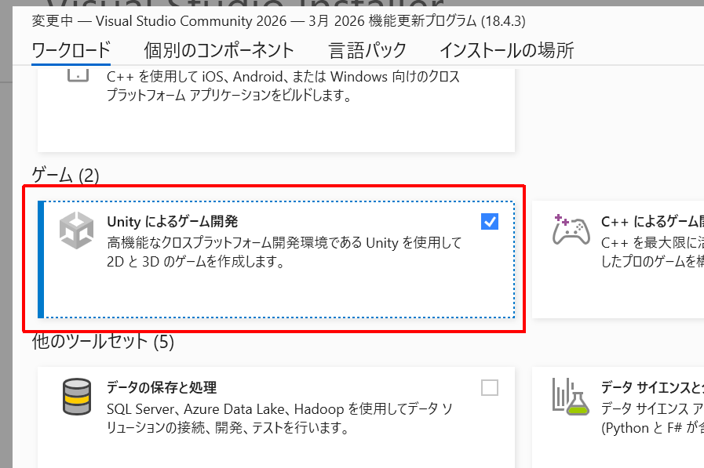

# テンプレートを用いた Mod 開発

開発想定環境は Windows 11 以上で Visual Studio 2026 以降を想定しています。

## 開発環境の整備

### Visual Stuido のインストール

以下からインストール

https://visualstudio.microsoft.com

.NET 及び .NET Framework での開発ができるようになるはず。

### Visual Studio Tools for Unity のインストール

メニュー → ツールと機能を取得 から「Unity によるゲーム開発」でインストール

 1. 
 1. 


> [!TIP]
> https://learn.microsoft.com/ja-jp/visualstudio/gamedev/unity/get-started/visual-studio-tools-for-unity?pivots=windows


## Mod テンプレートの取得と準備

### ダウンロード

https://github.com/sk-0520/elin-mod-dev-setup/archive/refs/heads/main.zip

 * ZIP でダウンロードすることを推奨します
 * git clone からの使用はテンプレート側での修正と競合する可能性があるため推奨しません

ダウンロードしたら適当なディレクトリに展開してください。

### 開発準備

展開したファイルのうち、 `Directory.Build.props.user` を開き `AssemblyName` を作成したい Mod のファイル名に変更してください。

```diff
<Project>
	<!-- Directory.Build.props から使用されます -->
	<PropertyGroup Condition="'$(MSBuildProjectName)' == 'Elin.Plugin.Main'">
		<!--
		Mod のプログラム名を指定
		Mod フォルダ名と DLL 名に使用されます
		-->
-		<AssemblyName>********</AssemblyName>
+		<AssemblyName>MyMod</AssemblyName>
	</PropertyGroup>

	<!-- 以下自由に設定してください -->
</Project>
```

> [!CAUTION]
> 本工程を実施しないとビルドできません

ここで設定されたアセンブリ名は、最終的な Mod ファイル名およびディレクトリ名として扱われるため、ファイル名として扱える文字列だけを使用してください。


### Steam/Elin のパス確認

`Directory.Build.targets` にてそれぞれのパスが定義されています。

```xml
<PropertyGroup>
    <SteamPath>C:\Program Files (x86)\Steam</SteamPath>
    <ElinPath>$(SteamPath)\steamapps\common\Elin</ElinPath>
    <ModPath>$(ElinPath)\Package\$(AssemblyName)</ModPath>
</PropertyGroup>
```

ユーザー環境によっては変更する必要があります。  
その場合は、 `Directory.Build.targets.user` に変更すべき設定を定義してください。

```xml
<PropertyGroup>
    <!-- Steam インストールパスの変更 -->
    <SteamPath>D:\Game\Steam</SteamPath>
</PropertyGroup>
```


## Mod テンプレートのファイル構成と提供機能

### テンプレート提供ファイルと Mod 開発者変更可能ファイル

基本的にテンプレートをローカルに展開した時点で全てのファイル編集は Mod 開発者側にありますが、
最新のテンプレート側に追従した方が不具合修正や機能追加のメリットを受けられます。

どこまでがテンプレート側持ちなのかを把握しておいた方が良いのですが、基本的にメインプロジェクトとメインプロジェクトから操作可能なものが Mod 開発者側保守範囲と考えてもらえれば多分問題ないかと思います。

### ルート一覧

| 印 | 削除可否 |
|:-:|---|
| 🚮 | 無くても Mod 作れます |
| ⚠️ | テンプレート提供機能が Mod に影響を与えるので消さないでください |

 * 🚮 .github/
 * 🚮 .vscode/
   * VSCode 設定, ちょっとした用途であった方がいいような、別にいいような
 * ⚠️ .dev-items/
   * テンプレートとして提供するあれこれ機能が入っています
 * 🚮 docs/
   * この文書が入ってる
 * ⚠️ Elin.Plugin.Generator/
   * テンプレート提供機能として色々頑張ってます
 * 🚮 Elin.Plugin.Generator.Test/
   * テンプレート提供側としては必要ですが、使用者側としては不要です
 * ⚠️ Elin.Plugin.Main/
   * テンプレート提供機能と Mod 実装の入り乱れ
   * 詳細は後述
 * 🚮 Elin.Plugin.Main.Test/
   * Elin.Plugin.Main のテスト
   * なくてもいいけど、あった方が少し安心
 * ⚠️ .editorconfig
   * 本来なくても OK じゃないとダメなんだけど、諸事情で必要です
 * 🚮 cspell.json
   * スペルチェック用定義ファイル
   * なんですが、このファイルを編集することはありません
 * ⚠️ Directory.Build.props
   * プロジェクト読み込み前の設定一覧
   * テンプレートとして必須です
 * ⚠️ Directory.Build.props.user
   * プロジェクト読み込み前の設定一覧(ユーザー設定)
   * テンプレート機能の追従が難しくなるので props の設定はこちらに記入してください
   * ここにアセンブリ名を書くようにしたのは本当に悲しい
 * ⚠️ Directory.Build.targets
   * プロジェクト読み込み後の設定一覧
 * 🚮 Directory.Build.targets.user
   * プロジェクト読み込み後の設定一覧(ユーザー設定)
   * テンプレート機能の追従が難しくなるので targets の設定はこちらに記入してください
 * ⚠️ Elin.Plugin.slnx
   * これをダブルクリックすれば Visual Studio が立ち上がるすごいファイルだよ
 * 🚮 exclusion.dic
   * スペルチェック用設定ファイル
 * ⚠️ Localization.json
   * 翻訳文言定義ファイル
   * 後述
 * ⚠️ Plugin.json
   * プラグイン定義ファイル
   * 後述
 * 🚮 README.md
   * お好きに

### Elin.Plugin.Main/

 * @Assets/
   * Elin Mod ディレクトリ仕様
     * https://docs.google.com/document/d/e/2PACX-1vQQ35ofQBT5yILPeZ4c5uMkmGOPMrT12f1vTvfi2dFgrt1T70lr8yMOpRAwZ_3cMvUNRsVR0Cf3qabh/pub
   * プロジェクトルートに Texture とか置くとソリューションエクスプローラがごちゃつくのでリスト上邪魔にならない名前にしています
   * ファイルが存在すれば配布ファイルに含まれます
     * ModHelp ディレクトリは配布ファイルに含まれません
     * ModHelp については後述
 * PluginHelpers/
   * テンプレート提供機能群です
   * 色々絡んでるので消さないでください
   * とりあえず後述になりますが、 `ModHelper` だけ使えればいいです
 * Properties/
   * 後述
 * Samples/
   * サンプルです
   * 初めて Mod を作る場合、一通り眺めたら消してください。初めてじゃなければ消してください
 * AssemblyInfo.cs
   * プロジェクトファイルによる  AssemblyInfo.cs 生成は抑制しているのでアセンブリ設定を行う場合はこちらで実施してください
 * Elin.Plugin.Main.csproj
   * プロジェクトファイル
   * さわらないでください
     * Directory.Build.props, Directory.Build.targets との合わせ技でちょっとしんどいので、ほんとさわらないでください
 * Plugin.cs
   * いわゆるエントリーポイントです
   * `PatchSample` メソッドは簡単にパッチを充てられない場合のサンプルになってますので、消してください
   * Mod 開発においては `AwakePlugin`, `OnDestroyPlugin` を編集の起点にして問題ないはずです
     * `Awake`, `OnDestroy` はテンプレート側で少しさわってるので上記メソッドを使用してください

### Plugin.json

プラグインの情報定義を記入してください。

 * `$.package`
   * [package.xml](https://docs.google.com/document/d/e/2PACX-1vQSITB8aYTycrnn3PxxGnPjNZ2_y1G3LDfXjC_PM5S_mTPCh6fv1vcj1bkfPbbUZ88WVb5_7T-62zYc/pub) の定義と同じです
   * `description`
     * 説明文は長くなる可能性があるので配列として、1要素1行で定義してください
   * `tags`
     * カンマ区切りはしんどいので配列として1要素1タグで定義してください
 * `$.mod`
   * Mod としての定義です
     * `version`
       * Mod のバージョンです
       * 最終的にアセンブリバージョンに反映されます
     * `useDebugId`
       * デバッグビルドした場合の、Mod ID をデバッグ用に変更するか
       * `true` で問題ないです
       * `BepInEx` で設定ファイルを出力する場合などに Mod ID が使用されるため、リリース版との競合を避ける目的で使用します
     * `log`
       * ログファイルを簡単に出力する場合に出力先を設定してください
       * デバッグ時のみ使用されます(`define DEBUG`)

Plugin.json の情報をもとに以下のクラスが生成されます。

* `Elin.Plugin.Generated.Package`
* `Elin.Plugin.Generated.Mod`

値は `const` なので属性に使用可能です。

> [!NOTE]
> package.xml と `BepInPluginAttribute` との謎結合が解消したくて作られた、適当ソースジェネレータです

### Localization.json

多言語をサポートします。

探し方が甘かったのかもしれないが、Elin本体側での言語切り替え処理が Mod に提供されているのか・はたまた定義ファイルを読ませればOKなのか、なんにも分からなくて、かつ、色々しんどかったので作成された何にも考えなくても言語切り替え可能にするための定義ファイルです。

下の説明読むよりサンプルで使っている例を見るのが一番手っ取り早いです。

#### `$.general`

通常の文言を定義していきます。

```json
{
    "general": {
        "seiShouNagon": {
            "JP": "いとおかし",
            "EN": "How charming"
        }
    }
    ...(略)...
}
```

そいで、コード上では、

```csharp
using Elin.Plugin.Main.PluginHelpers;

class Class {
    void Method()
    {
        Msg.SayRaw(ModHelper.Lang.General.SeiShouNagon);
    }
}
```

とすることで Class.Method が呼ばれたタイミングで、メッセージログに「いとおかし」が表示されます。

Elin の言語設定を英語に変えて再度呼び出すと「How charming」が表示されます。

Json 側のプロパティ名はキャメル形式ですが、C#側で使用する場合はパスカル形式になる点に注意してください。


#### `$.format`

書式付き文言を定義していきます。

```json
{
    ...(略)...
    "format": {
        "departingInSeconds": {
            "JP": "あと${SEC}秒で出発",
            "EN": "Departing in ${SEC} seconds",
            "parameters": {
                "SEC": {
                    "type": "int"
                }
            }
        }
    }
}
```

そいで、コード上では、

```csharp
using Elin.Plugin.Main.PluginHelpers;

class Class {
    void Method()
    {
        Msg.SayRaw(ModHelper.Lang.Formatter.FormatDepartingInSeconds(sec: 10));
    }
}
```

とすることで Class.Method が呼ばれたタイミングで、メッセージログに「あと10秒で出発」が表示されます。

Elin の言語設定を英語に変えて再度呼び出すと「Departing in 10 seconds」が表示されます。

`$.general` との違いは先頭が `Format` になったメソッドとして使用することです。

注意点として引数は名前付きで呼び出す必要があります（アナライザで強制されます）。

#### 言語指定

設定できる言語は以下の通りです。

 * JP
 * EN
 * CN
 * ZHTW
 * KR

ただし Elin 本体は JP/EN のみ、公式サポートとしては CN のみが提供されているため、それ以外の言語の挙動については不明です。

## ModHelper

静的クラス `ModHelper` を使用することでテンプレート提供機能を使用できます。

おもに使用するのは以下くらいです。

 * `ModHelper.Logger`
   * プラグインとして正式にログを出力する窓口です
 * `ModHelper.Lang`
   * 前述の言語処理周りとなります
 * `ModHelper.Elin`
   * Elin 本体処理のヘルパーになります
   * が、テンプレート提供機能としては何もないに等しいです
 * `ModHelper.MessageDebug`
   * デバッグ時のみメッセージログを表示します
   * メッセージが表示できる場合のみ使用してください
 * `ModHelper.WriteDebug`
   * デバッグ時のみファイルログを出力します
   * ファイルは Plugin.json の mod.log となります
 * `ModHelper.LogDebug`
   * デバッグ時のみメッセージログ + ファイルログを出力します
   * メッセージが表示できる場合のみ使用してください
 * `ModHelper.LogNotExpected`
   * Mod が想定しない場合に内容をログ出力します
   * これは非デバッグ版でも有効です
 * `ModHelper.LogNotify`
   * Mod からプレイヤーに通知するようなログを出力します
   * これは非デバッグ版でも有効です
   * ゲームプレイで表示するようなものではなく、ユーザー起因で発生したエラーなどを伝えるもので、ゲーム体験を損なう前提で使用します

## 設定クラスの BepInEx.Configuration サポート

> [!WARNING]
> 設定クラスは Mod 実装者が編集可能である前提です。よそのライブラリで作られたクラスを設定に持たせるのは小手先回避できるか、不可能な場合があります。

こんな設定があったとします。

```csharp
public class MyModNestedAbcConfig
{
    public float Foo { get; set; }
}

public class MyModNestedXyzConfig
{
    public double Bar { get; set; }
}

public class MyModRootConfig
{
    public MyModNestedAbcConfig Abc { get; set; } = new MyModNestedAbcConfig();
    public MyModNestedXyzConfig Zyx { get; set; } = new MyModNestedXyzConfig();

    public int IntValue { get; set; }
    public string StrValue { get; set; }
}
```

こういったクラスは設定を扱うには便利なんですが、 `BepInEx.Configuration` を使用する際に単純にもう面倒です。

ので、テンプレートでは以下の制約を満たした場合にこれを簡略化する機能を提供します。

 * 依存する設定クラスは全て同じ名前空間(現在のテンプレート実装上の制約)
 * `BepInEx.Configuration.ConfigEntry` で使用可能な型のみに限定する
 * 値型プロパティは `virtual` にする
 * クラス型プロパティは非 `virtual` にする
   * 実装メモ: 別にこの制約はいらんかったなぁ
 * 各設定クラスは `sealed` しない
 * 設定のルートは `partial` にする

以下のように変更します。

```csharp
using Elin.Plugin.Generated; // 追加

public class MyModNestedAbcConfig
{
    public virtual float Foo { get; set; } // virtual
}

public class MyModNestedXyzConfig
{
    public virtual double Bar { get; set; } // virtual
}

[GeneratePluginConfig] // 追加☆これが大事
public partial class MyModRootConfig // partial
{
    // これはそのまま
    public MyModNestedAbcConfig Abc { get; set; } = new MyModNestedAbcConfig();
    public MyModNestedXyzConfig Zyx { get; set; } = new MyModNestedXyzConfig();

    public virtual int IntValue { get; set; } // virtual
    public virtual string StrValue { get; set; }
}
```

ただ、`virtual` と `GeneratePluginConfig` 属性を設定しても使用できないので以下のようにスタートアップ処理で設定ファイルへのバインドを行う必要があります。  
※簡略化のためテンプレート提供 Plugin.cs と構造は異なります。

```csharp
class Plugin
{
    void Awake()
    {
        // 初期値をあらかじめ作成
        var defaultConfig = new MyModRootConfig()
        {
            Abc = new MyModNestedAbcConfig() {
                Foo = 3.14f
            },
            Zyx = new MyModNestedXyzConfig() {
                Bar = 2.71
            },
            IntValue = 42,
            StrValue = "aiueo",
        };

        // バインド
        var config = MyModRootConfig.Bind(Config, defaultConfig);
        // 以降は usingConfig を使用することで設定の保存などは自動で行われます
        config.Abc.Foo = 3f;
    }
}
```

`GeneratePluginConfigAttribute` を適用したクラスには、静的メソッド `Bind` とインスタンスメソッド `Reset` が生えます。

`Bind` は上記のサンプルのように初期値の設定と、バインド結果の設定オブジェクトを返却します。
ここで返却された設定オブジェクトを Mod 内で使用してください。  
※静的クラスで持ち運ぶことになるかと。

`Reset` は現在の設定値を初期に戻します。
Mod 都合で使うことは少ないかもしれませんが、ユーザー側で初期化する場合なんかに呼び出してください。

実装上の話をすると `Bind` で元になったクラスを継承したクラスを作成し、 `virtual` の部分に対して以下のようなことを行っています。

```csharp
override int IntValue
{
    get => ConfigEntry.Value;
    set => ConfigEntry.Value = value;
}
```

ので、 `new MyModRootConfig()` したオブジェクトと、 `config = MyModRootConfig.Bind(...)` の返却オブジェとは根っこから性格がことなるため、混合して取り扱う場合は注意してください。  
上記の例だと、`Bind` で返される型は `class MyModRootConfigProxy: MyModRootConfig` となっており、プロパティのクラスもそれぞれ置き換わっています。

なお、 `IgnorePluginConfigAttribute` をプロパティに設定することでそのプロパティはこの置き換え処理は実施されません。


## デバッグ

> [!WARNING]
> 出来るときはできるし、出来ないときは出来ません。わっからん！

Visual Studio のスタートアッププロジェクトが「Elin.Plugin.Main」の場合、いくつかのプロファイルが設定されています。

* Steam
  * ビルド後、Elin を起動します
  * Steam が起動されている状態で実行してください
    * Steam 未起動状態で実行すると、悲しくなります
* DLL: 1.準備
  * デバッグ用の DLL を取得し、Elin 側への差し替え用準備を行います
* DLL: 2.デバッグ版に切り替え
  * Elin に対し、デバッグ用 DLL に差し替えます
* DLL: 3.製品版に切り替え
  * Elin に対し、製品版 DLL に差し戻します

> [!IMPORTANT]
> Mod 総本山 [Elin Modding Wiki](https://elin-modding-resources.github.io/Elin.Docs/) 提供 DLL を使用させていただいています。 感謝しかない。

「DLL: 1」を使用した後「DLL: 2,3」を使用してください。  
※細かい挙動は処理を読んでください。

デバッグ用 DLL に切り替えた後、 Elin を起動し、Unity にアタッチするとデバッグできます(できたりできなかったり)。

(TODO: 拡張機能によるアタッチの画像)

開発から離れて通常プレイを楽しむ場合などは製品版に切り替えること忘れないようにしてください。

## Mod Help 用ヘルプファイルの作成

[Mod Help](https://steamcommunity.com/workshop/filedetails/?id=3406542368) のヘルプファイル作成用テンプレートとして、`Elin.Plugin.Main/@Assets/ModHelp/help.xhtml` を用意しています。

ヘルプが不要な場合は `help.xhtml` を別名にするかディレクトリごと削除してください。

詳細は `help.xhtml` と同梱している README.md を参照してください。

`help.xhtml` をブラウザで表示すればなんとなーくの構造が見れるようになるので便利な気がしてます。

> [!NOTE]
> 大枠の仕組みは手で作ったけど、しんどくなって残りは AI に作らせたから、バグってたらすまぬ。


## GitHub Actions

GitHub Actions の定義をテンプレートとして提供しています。
ワークフローが完了するとリリース版の成果物が出力されます。

Windows イメージでガンガン走る点にご注意ください。

> [!WARNING]
> CI でビルドおよびテストを通すために、お行儀が良くないというか、なんというか、うん、不安な場合は `.github/` を削除してください。

## その他

### Elin.Plugin.Main のディレクトリ名は変更可能か

 * 変更しない想定でテンプレートを作成しています
 * 変更する場合は ``Elin.Plugin.Main` を grep して必要箇所をそれぞれ置き換えてください

### Localization.json の変更が反映されない

 * エラーが発生している場合は記述を確認してください
   * 特に `$.format` 辺りはチェック処理が色々あるのでエラーになりやすいです
 * エラーがない場合、Visual Studio の再起動を試してみてください

### テンプレートを使用した Mod の著作権は誰に帰属するか

 * あなたに帰属します
 * 諸事情でライセンスを設定できていない状態です([issue#1](https://github.com/sk-0520/elin-mod-dev-setup/issues/1))
   * 将来的にライセンスを設定したとしても WTFPL です

### テンプレートに追従って具体的にどうすれば？

 * ZIP 落としてきて既存のファイルに上書きして diff 確認するくらいしか手段はないです、はい
 * テンプレートを使った Mod 開発はその取得時のバージョンと一蓮托生する気持ちで取り組んだ方が精神衛生上良いかもしれません


